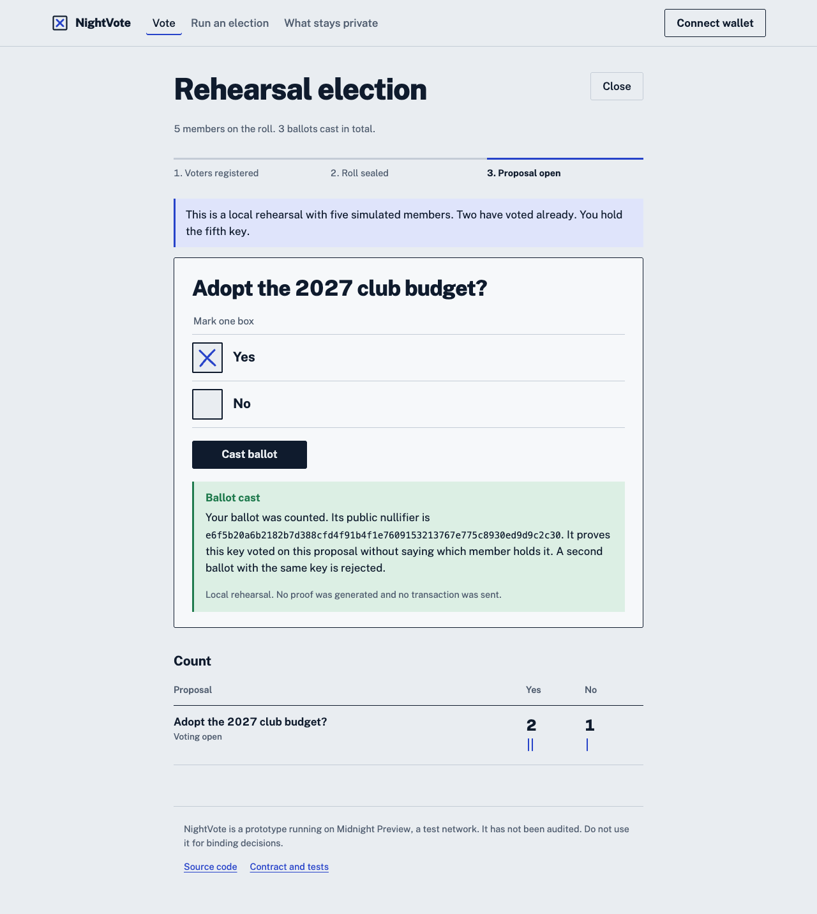
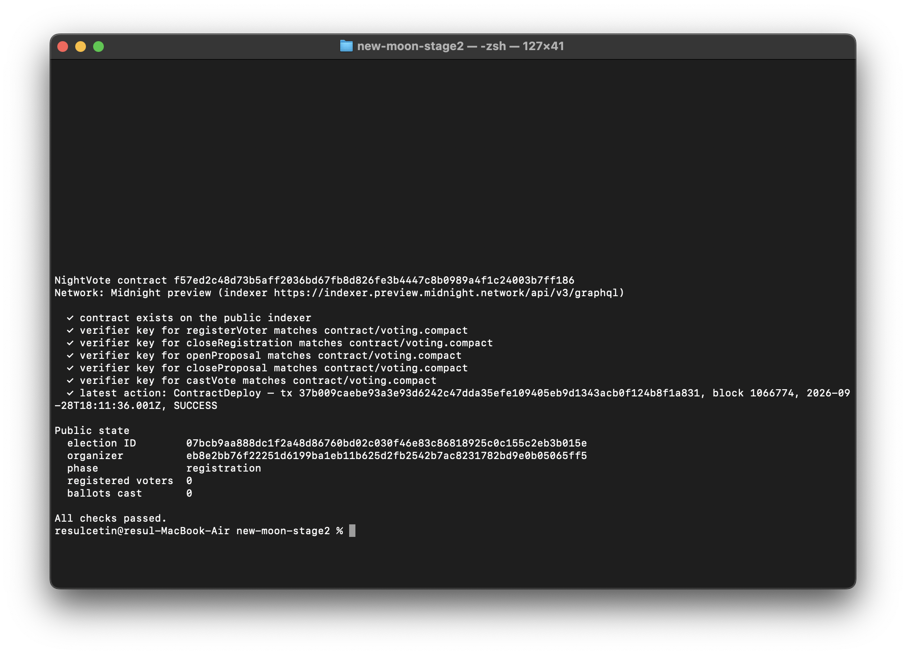
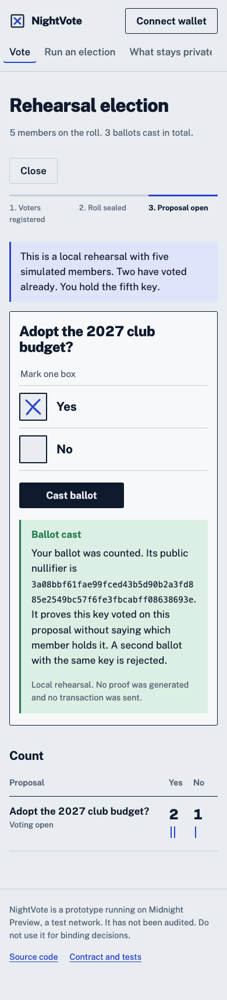

# NightVote

**One member, one vote, no names attached.** NightVote is a prototype voting dApp for clubs and communities on Midnight Preview. Members prove they are on a sealed roll and vote once per proposal. Nobody, including the organizer, can see which member cast which ballot.

[](https://github.com/resulcetin09/NightVote/actions/workflows/ci.yml)

> **Status: prototype.** It has not been audited and runs on Preview, a test network. Ballots are **anonymous, not secret**: each ballot's yes/no choice is public, but it is not linked to the member who cast it. See [Privacy model](#privacy-model).

Rise In — New Moon to Full, Stage 2. The contract and its tests come from [Stage 1](https://github.com/resulcetin09/new-moon-stage1). `contract/voting.compact` is the same file.



## Deployed contract

| | |
| --- | --- |
| Network | Midnight **Preview** |
| Contract address | `f57ed2c48d73b5aff2036bd67fb8d826fe3b4447c8b0989a4f1c24003b7ff186` |
| Deploy transaction | `37b009caebe93a3e93d6242c47dda35efe109405eb9d1343acb0f124b8f1a831` |
| Block | 1,066,774 (2026-09-28 18:11:36 UTC), status `SUCCESS` |
| Election ID | `07bcb9aa888dc1f2a48d86760bd02c030f46e83c86818925c0c155c2eb3b015e` |
| Evidence | [`deployments/preview.json`](deployments/preview.json). Re-check with `npm run verify:preview` |



The contract was deployed from the NightVote app with Lace on Preview. The proof was generated by the local proof server, and Lace balanced, signed and submitted the transaction. The on-chain verifier keys of all five circuits match the ones compiled from `contract/voting.compact` in this repository.

Anyone can check it without a wallet:

```sh
npm ci && npm run setup:compact && npm run compile
npm run inspect:preview -- f57ed2c48d73b5aff2036bd67fb8d826fe3b4447c8b0989a4f1c24003b7ff186
npm run verify:preview
```

Earlier versions of this README listed an address that the old code generated with `randomBytes`. It was never on-chain and has been removed.

## What changed from the first version

The first NightVote was a UI over a simulation. It had a fake wallet mode, random transaction hashes, timed "proof stages" and an in-memory ledger. All of that has been deleted. What replaced it:

| Before | Now |
| --- | --- |
| Simulated circuit caller | Compiler-generated bindings (`compactc 0.31.1`) run through `findDeployedContract` and `callTx`. Proofs come from your local proof server, and transactions are balanced and signed by Lace and submitted to Preview |
| Fake wallet when Lace is missing | No fallback. Without a wallet, the app says how to install one |
| Tallies held in React state | Every count, phase and proposal is decoded from the contract state returned by the Preview indexer |
| `castVote` open to anyone, any number of times | The circuit checks roll membership (private Merkle path), a proposal-scoped nullifier (one vote per member per proposal) and that the proposal is the open one |
| Mock deploy writing a random address | `npm run deploy:preview` deploys with `deployContract` and `setNetworkId` and records every finalized transaction |

The only thing that runs without a network is **Rehearse a ballot**. It executes the compiled circuits in your browser and is labelled on every screen as generating no proof and sending no transaction.

## How it works

1. **The organizer** connects Lace and creates an election. This deploys a contract whose constructor stores a random election ID and a commitment to the organizer's secret. The organizer saves the organizer file, which holds that secret.
2. **Each member** opens the shared link and creates their own voter key in the browser. They send the organizer only its commitment, `H("nightvote:voter:v1", electionId, secret)`.
3. The organizer **registers** each commitment and **seals the roll**. After that, nobody can be added.
4. The organizer **opens a proposal** (up to 32 bytes of public text). Only one proposal can be open at a time.
5. A member **casts a ballot**. The proof shows that their commitment is in the roll's Merkle tree without saying which leaf it is. It publishes the nullifier `H("nightvote:nullifier:v1", electionId, proposalId, secret)`. A second ballot from the same key produces the same nullifier and the circuit rejects it.
6. The organizer **closes** the proposal and can open the next. Nullifiers differ per proposal, so one member's ballots on different proposals cannot be linked.

## Privacy model

| Public on Preview | Known only to the member |
| --- | --- |
| Roll size and Merkle root | Which roll entry is theirs |
| Proposal text and yes/no counts | Their voter key |
| Each ballot's choice and nullifier | That the ballot was theirs |
| Transaction time and fee-paying wallet | Proof inputs (local proof server only) |

Why not secret ballots: a ballot transaction increments either the yes or the no counter on the public ledger, so its choice is visible. Hiding the choice while still producing a correct public tally needs homomorphic tallying or a mix-net, which this prototype does not implement. NightVote does not claim secret ballots.

Where anonymity can weaken: small electorates (a unanimous vote reveals everyone's choice), the fee-paying wallet, timing correlation, an organizer who generated members' keys, and a compromised device. The app's **What stays private** page explains each of these.

The app refuses a remote proof server, so voter secrets are only sent to `localhost`.

## Run it

Node.js 24 (`.nvmrc`), macOS or Linux.

```sh
npm ci
npm run setup:compact   # Compact 0.31.1, SHA-256 verified
npm run compile         # circuits, bindings and proving keys (copied to public/contract)
npm run dev             # http://127.0.0.1:5173
```

To use Preview from the browser:

1. Install [Lace with Midnight support](https://www.lace.io/), select **Preview** and fund the wallet from the [Preview faucet](https://faucet.preview.midnight.network/).
2. Run `docker compose up -d` to start `proof-server:8.1.0` on `127.0.0.1:6300`, and select it as the proof server in Lace.
3. Connect the wallet in NightVote.

## Deploy from the command line

```sh
docker compose up -d
MIDNIGHT_SEED=<64-hex seed> npm run deploy:preview
npm run verify:preview
```

`deploy:preview` deploys the contract and runs one full election: 3 voters, roll sealed, proposal opened, 3 ballots, a double vote rejected by the circuit, proposal closed. It writes `deployments/preview.json` with the transaction IDs and block heights that the indexer reported. `verify:preview` needs no wallet. It checks that record against the public indexer: the contract exists, its on-chain verifier keys match this source, the election ID, organizer, roll size and tallies match, and every transaction finalized in the recorded block. CI runs the same check once the file is committed.

## Tests

```sh
npm test            # 24 tests: 17 Compact runtime tests + app tests
npm run test:e2e    # 12 browser tests (desktop + mobile), including axe WCAG A/AA
npm run check       # compile + typecheck + unit tests + build
```

- **Contract (`tests/contract.test.ts`):** runs the compiled circuits for double voting, unregistered voters, malicious witnesses, forged Merkle paths, unauthorized organizer actions, every invalid lifecycle transition, and public-transcript privacy.
- **App (`tests/app.test.ts`):** voter-key commitments match the contract, file parsing is strict, proposal text round-trips through its 32-byte encoding, the proof server must be local, and the rehearsal rejects a second ballot with the circuit's own error.
- **Browser (`e2e/`):** accessibility on every view, the rehearsal ballot flow, input validation, and the no-wallet message.

CI (`.github/workflows/ci.yml`) runs compile, typecheck, all tests, the build and the browser tests on every push, then verifies the Preview evidence if it is present.

## Pinned toolchain

Compact 0.31.1 · compact-runtime 0.16.0 · compact-js 2.5.1 · ledger-v8 8.1.0 · Midnight.js 4.1.1 · DApp connector API 4.0.1 · wallet SDK facade 4.0.1 · proof-server 8.1.0. All npm versions are exact and the lockfile is committed. Compiler output in `contract/managed/voting/` is committed; compilation is deterministic, and CI fails if a fresh compile differs from it.

## Layout

```text
contract/voting.compact      contract (same as Stage 1)
src/lib/midnight.ts          Lace providers, deploy, callTx, indexer reads
src/lib/election.ts          decodes public ledger state for display
src/lib/wallet.ts            DApp connector discovery and network checks
src/lib/files.ts             organizer file and voter key formats
src/lib/rehearsal.ts         in-browser circuit rehearsal (no proof, no network)
src/components/              ballot, organizer and privacy views
cli/                         Preview deploy and independent verification
tests/  e2e/                 unit, contract and browser tests
```

## Design

A ballot paper, not a dashboard: cool grey paper, navy ink and ballpoint-blue marks, set in Public Sans, a typeface made for public-sector services. The cross is drawn into the box when you choose, and counts are shown as tally marks. The design supports dark mode, reduced motion, keyboard use and phone screens.



## License

Apache-2.0
